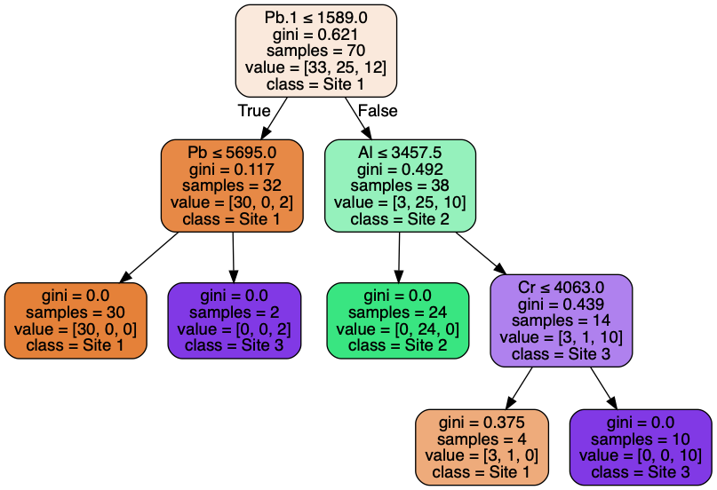

# de Luna

Analyzing Archeological data collected form the Luna site in Pensacola, FL.

Working closely with the field director at the University of West Florida to analyze artifacts. 

_The goal it to find something with a computer that the naked eye can't._

The [Predicting Era of Artifact NoteBook](Predicting Era of Artifact .ipynb) may help in predicting a random pottery shards 'era' based on its X-ray characteristics. 

